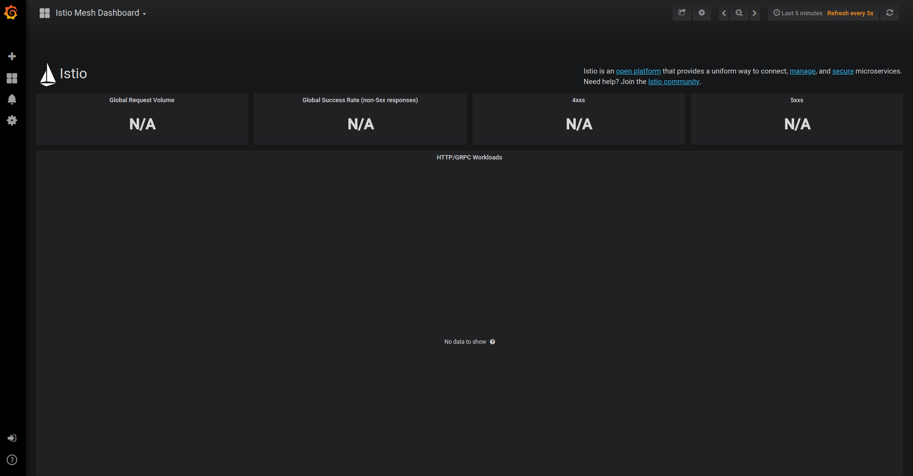
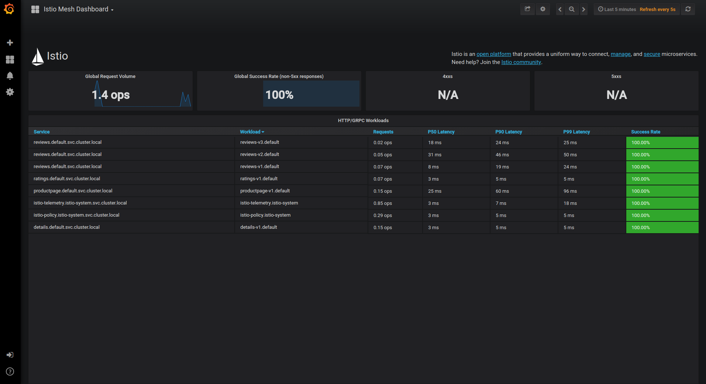
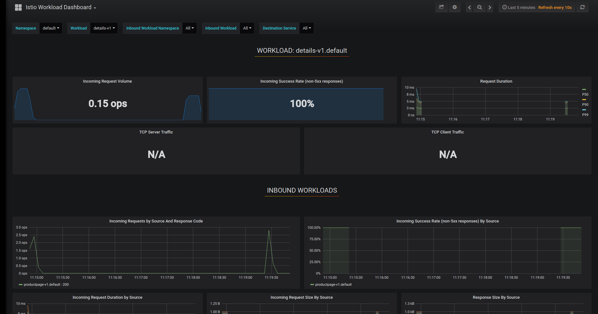

이번 task 에서는 mesh 트래픽을 모니터링 하기 위한 Istio Dashboard 설정과 사용 방법에 대해 소개한다.
이 task 중에 당신은 istio add-on Grafana 와 Service Mesh 트래픽 데이터를 보기 위한 web-based 인터페이스를 사용하게 될 것이다.

# Before you begin
- 쿠버네티스 클러스터에 Istio를 설치하세요. 만약 설치하는데 Helm을 사용한다면 Grafana add-on --set grafana.enabled=true 옵션을 활성화 하세요
```
helm upgrade --install istio ./install/kubernetes/helm/istio --namespace istio-system --set grafana.enabled=true --set tracing.enabled=true 
```
- Bookinfo 애플리케이션을 배포하세요

# Istio Dashboard 보기
1. prometheus 서비스가 클러스터 안에서 실행중인 것을 확인하세요.  
쿠버네티스 환경에서 아래 명령어를 실행하세요.
```
kubectl -n istio-system get svc prometheus
NAME         CLUSTER-IP     EXTERNAL-IP   PORT(S)    AGE
prometheus   10.59.241.54   <none>        9090/TCP   2m
```
2. 클러스터에서 Grafana 서비스가 실행중인 것을 확인하세요
쿠버네티스 환경에서 아래 명령어를 실행하세요.
```
$ kubectl -n istio-system get svc grafana
NAME      CLUSTER-IP      EXTERNAL-IP   PORT(S)    AGE
grafana   10.59.247.103   <none>        3000/TCP   2m
```
3. Grafana UI를 통해 Istio Dashboard 를 열어보세요.  
쿠버네티스 환경에서 아래 명령어를 실행하세요.
```
kubectl -n istio-system port-forward $(kubectl -n istio-system get pod -l app=grafana -o jsonpath='{.items[0].metadata.name}') 3000:3000 &
```
웹브라우저에서 [http://localhost:3000/dashboard/db/istio-mesh-dashboard](http://localhost:3000/dasboard/db/istio-mesh-dashboard) 방문해보세요.  
Istio Dashboard 다음과 유사하게 보여질 것이다.  

4. Service Mesh로 트래픽 전송
Bookinfo 샘플의 경우 http://$GATEWAY_URL/productpage 페이지를 웹에서 접속하거나 아래 명령어를 통해 요청하세요.
```
curl http://$GATEWAY_URL/productpage
```
```
$GATEWAY_URL은 Bookinfo 샘플에서 설정된 값입니다.
```

약간의 트래픽을 생성하기 위해 페이지를 몇번 갱신한다. (또는 명령얼 몇번 더 수행한다.)  
Istio Dashboard를 다시 한번 본다. 생성된 트래픽이 반양되어 있어야 한다. 다음과 비슷하게 보여진다.

이 대시보드는 Mesh 안에 있는 서비스와 워크로드와 함께 Mesh 의 전체적인 view를 제공한다.  
당신은 아래 설명된 구체적인 대시보드 탐색을 통해 서비스와 워크로드에 대한 디테일한 정보를 얻을 수 있다.
5. 서비스 대시보드 시각화
Grafana 대비보드 왼쪽 코너에 있는 탐색 메뉴로부터 Istio Dashboard 를 탐색하거나 [http://localhost:3000/dashboard/db/istio-service-dashboard](http://localhost:3000/dashboard/db/istio-service-dashboard) 웹브라우징하여 방문 가능하다.  
istio 서비스 대시보드는 아래와 유사하다.

이 대시보드는 서비스를 위한 client workloads(서비스를 호출하는 workload)와 service workload(이 서비스를 제공하는 워크로드) 그리고 서비스에 대한 자세한 metrics를 제공한다.
6. 워크로드 대시보드 시각화
Grafana 대시보드 왼쪽 코너 탐색 메뉴에서 당신은 Istio 워크로드 대시보드를 탐색하거나 [http://localhost:3000/dashboard/db/istio-workload-dashboard](http://localhost:3000/dashboard/db/istio-workload-dashboard) 웹브라우징을 통해 접속 가능하다.  
Istio 워크로드 대시보드는 아래와 유사하다.

이 대시보드는 각 워크로드와 inboud 워크로드(이 워크로드에 요청을 보내는 워크로드) 와 해당 워크로드에 대한 outbound service(이 워크로드가 요청을 전송하는 서비스) 에 대한 자세한 mertics를 제공한다.

# About the Grafana add-on
Grafana add-on은 Grafana의 사전에 이미 구성된 설정이다. 기본 이미지 (**grafana/grafana:5.2.3**) Prometheus 데이터 소스와 Istio 대시보드가 설치되어 시작되도록 수정되었다. 특히 istio 와 mixer의 기본 설치 파일은 global(모든 서비스에 사용) metrics 기본 설정으로 제공한다. Istio 대시보드는 기본 istio metric 설정과 Prometheus 백엔드와 결합하여 사용되로독 만들어졌다.  

Istio 대시보드의 주요 3가지 구성
1. A Mesh Summary View. 이 세션은 Mesh의 전체적인 요약 관점을 제공하고, Mesh 에서 HTTP/gRPC 그리고 TCP 워크로드를 보여준다.
2. Individual Service View. 이 섹션은 Mesh 안에서 각각의 개별적인 서비스를 위한 요청과 응답에 대한 metrics를 제공한다. 이러한 것은 이 서비스를 위한 클라이언트와 서비스 워크로드에 대한 metrics 또한 제공한다.
3. Individual Workloads View. 이 섹션은 Mesh 안에서 각각의 개별적인 워크로드를 위한 요청과 응답에 대한 mertices를 제공한다. 이러한 뷰는 또한 워크로드를 위한 inbound workload 와 outboud service에 대한 metrics 제공한다.  

대시보드 생성, 설정, 수정에 대한 좀더 자세한 내용은 [Grafana Documendation](https://grafana.com/docs/)을 통해 확인 가능하다.